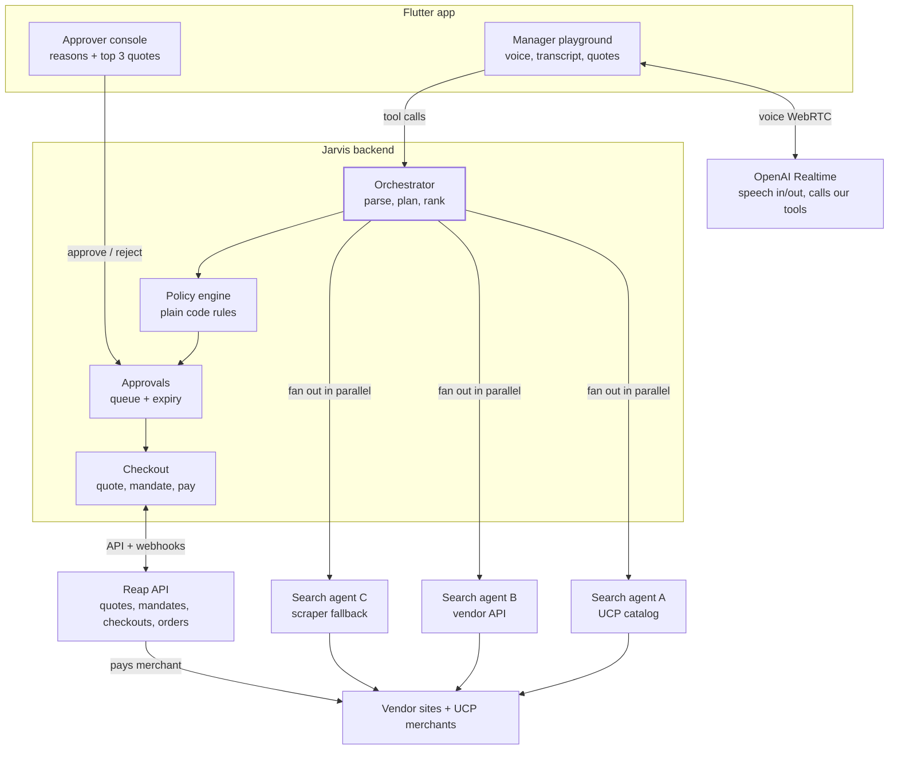
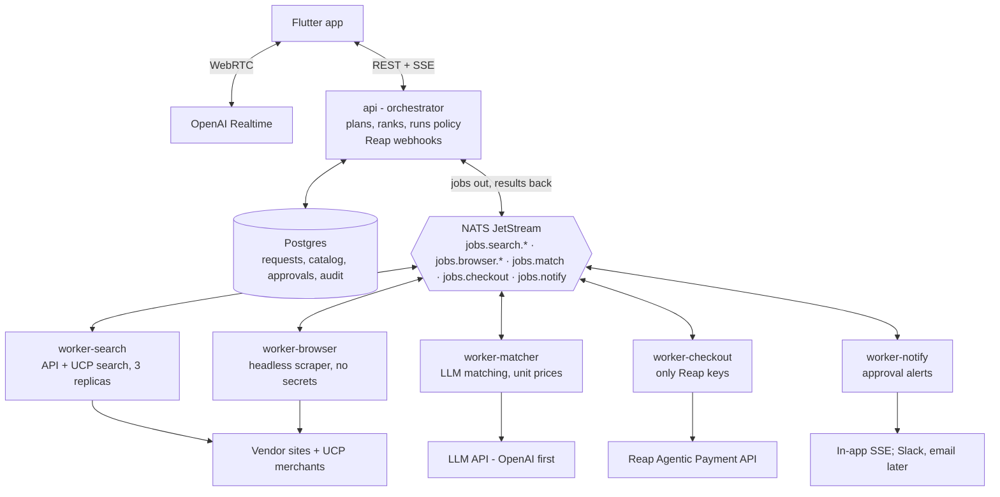
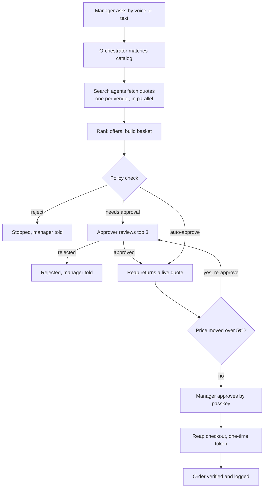

# Jarvis Office: Procurement Agent PRD

Oct 9, 2026 · Ketan Mujumdar

> Living version: https://claude.ai/code/artifact/8add502c-5a77-4735-8e1a-af580ef00506

## Overview

Jarvis lets an office manager restock the office by voice. An orchestrator agent finds the best price across vendors, checks the order against policy, and pays through Reap Agentic Payment.

**Problem.** Restocking is manual today. Someone checks several vendor sites, compares prices, gets approval for anything unusual, and pays with a shared card. That is slow, inconsistent and hard to audit.

**MVP scope (in):**

- A web playground with a live voice session (OpenAI Realtime) and a transcript.
- An orchestrator that turns a spoken request into line items and plans the search.
- Parallel search agents, one per vendor, that return comparable price quotes.
- A seeded approved-items catalog with preferred vendors and price ceilings.
- A deterministic policy engine with spending limits and an approval queue.
- Checkout and payment through Reap (quote, passkey mandate, checkout, order verification).

**Out of scope for the MVP:** multi-office budgets, ERP or accounting sync, returns and refunds, and recurring scheduled orders.

## Users and goals

There are two roles. The office manager orders by voice, and the approver signs off on exceptions.

| Role | Does | Wants |
| --- | --- | --- |
| Office manager | Speaks requests, reviews quotes, confirms routine orders | Restock in under 2 minutes without opening vendor sites |
| Approver (finance or ops lead) | Approves off-list items and over-limit orders | See why an exception is needed and what it costs before it is bought |
| Admin | Maintains the approved catalog, vendors and limits | Change policy without a code change |

**Example requests:**

- "We're out of printer paper and coffee pods, reorder the usual." Both items are on the approved list and under the limit, so the order goes ahead after one passkey tap.
- "Get us a standing desk for the new hire." The item is off-list, so it goes to the approval queue with the 3 best quotes.

## Architecture

There are four layers: the browser UIs, the backend services, the search agents, and the outside systems they call.



The voice model is only an interface. It turns speech into tool calls, and the backend owns all state, rules and money movement. That keeps the system safe and testable: you can run every flow from text input with no voice at all.

**Design principles**

- **LLM proposes, code decides.** The orchestrator and search agents use an LLM. The policy engine, approvals and checkout are plain code.
- **One request record.** A `PurchaseRequest` state machine in Postgres drives the flow, so agents can fail and retry without losing progress.
- **Adapters, not agents per site.** There is one search-agent design with a pluggable vendor adapter, so adding a vendor is one file plus a row of config.

## Services and workers

The Go `api` service is the only brain. It plans, keeps state in Postgres and runs policy in-process, and hands every slow or risky task to a stateless worker container over NATS JetStream.



Workers never touch Postgres. They get everything they need in the job message and publish a result back, so a worker can crash or scale without losing state.

| Worker | Job | Why it is separate | MVP |
| --- | --- | --- | --- |
| `worker-search` | Query one vendor through its API or UCP catalog and return normalised offers | Light and parallel, so it scales out with replicas | Yes |
| `worker-browser` | Scrape a site that has no API | Heavy (Chromium) and flaky, so it is sandboxed with no secrets and strict CPU and memory limits | One site |
| `worker-matcher` | Use an LLM to match noisy listings to catalog items and work out pack size and unit price | Keeps LLM cost and latency off the search path, and is tuned on its own | Yes |
| `worker-checkout` | Reap quote, mandate, checkout and order verification | The only container holding Reap credentials, so the blast radius stays small | Yes |
| `worker-notify` | Approval requests and order updates | Side effects that retry without blocking the flow | In-app SSE only |

**Job contract:** each job carries `{v, job_id, request_id, line_item_id, kind, payload, deadline}` and is idempotent on `job_id`. JetStream redelivers unacked jobs, and the orchestrator ranks whatever results arrive before the deadline.

## Code structure

The project is one monorepo with a Go module for the backend and every worker, plus a Flutter app. Each container is a separate `cmd/` binary that shares `internal/` packages.

```
jarvis_office/
├── backend/                      # Go module
│   ├── cmd/
│   │   ├── api/                  # orchestrator + REST/SSE + Reap webhooks receiver
│   │   ├── worker-search/        # vendor API + UCP catalog search
│   │   ├── worker-browser/       # headless scraper fallback
│   │   ├── worker-matcher/       # LLM product matching + unit normalisation
│   │   ├── worker-checkout/      # Reap quotes, mandates, checkouts, orders
│   │   └── worker-notify/        # approval + order notifications
│   ├── internal/
│   │   ├── api/                  # HTTP handlers, SSE progress stream
│   │   ├── realtime/             # mints short-lived OpenAI Realtime tokens
│   │   ├── orchestrator/         # request state machine, planner (LLM), ranker
│   │   ├── policy/               # deterministic rules, no LLM
│   │   ├── approvals/            # queue, expiry, re-quote
│   │   ├── queue/                # NATS JetStream client, job + result types
│   │   ├── agents/               # shared agent loop + VendorAdapter interface
│   │   │   └── adapters/         # mock/, ucp/, web/
│   │   ├── reap/                 # typed Reap API client + webhook verification
│   │   ├── llm/                  # tool-calling wrapper (OpenAI first)
│   │   └── store/                # Postgres access, migrations
│   └── seed/catalog.yaml         # approved items, vendors, limits
├── app/                          # Flutter (web first, iOS/Android later)
│   └── lib/
│       ├── core/api/             # client generated from the backend OpenAPI spec
│       ├── features/voice/       # Realtime WebRTC session, tool-call relay
│       ├── features/request/     # line items, live agent progress, quote table
│       ├── features/approvals/   # approver console
│       └── features/orders/      # history + audit trail
├── deploy/docker-compose.yml     # postgres, nats, api, workers
└── docs/
```

**Why Flutter:** One codebase covers the web playground now and the mobile app later. `flutter_webrtc` runs the OpenAI Realtime voice session on web, iOS and Android.

**Contracts:** The REST API is described in OpenAPI, and the Flutter client is generated from it. Queue messages are Go structs in `internal/queue`, versioned with a `v` field.

## End-to-end flow

Every order passes two gates: the policy check on the searched price, and a second check on Reap's live quote.



The passkey tap is the only step that moves money, and its mandate cap equals the approved amount. Even a wrong agent result cannot overspend.

## Functional requirements

The LLM proposes and plain code decides. Approval and payment rules never depend on model output alone.

**FR1. Voice playground**

1. A browser page starts an OpenAI Realtime session using a short-lived token from our backend.
2. The voice model only talks and calls tools. It exposes `create_order_request`, `get_request_status` and `confirm_order`, and never searches or pays directly.
3. A live panel shows the transcript, the parsed line items, agent progress, the quote table and the approval state.
4. Text input works as a fallback for noisy rooms and testing.

**FR2. Orchestrator**

1. Normalizes each request into line items (item, quantity, urgency) and matches each one to the approved catalog (exact SKU, then fuzzy name match, then off-list).
2. Builds a search plan: which vendors to query for which items, using each catalog item's preferred vendors first.
3. Publishes search jobs to worker containers over NATS, with a deadline per request (default 20 s), and ranks partial results if some workers fail.
4. Ranks offers by landed cost (unit price × qty + shipping + tax), then delivery date, then vendor preference.
5. Builds a basket that minimises total landed cost, and may split items across vendors.
6. Keeps all state in a persisted request record, so a page refresh or restart does not lose progress.

**FR3. Search agents**

1. There is one agent type with a vendor adapter per site, behind a common `VendorAdapter` interface (`search`, `get_offer`, `supports_checkout`).
2. Adapters are, in order of preference: a Reap/UCP merchant catalog, a vendor API, a scraped page (fallback only).
3. Each agent returns structured offers: vendor, SKU, title, unit price, currency, pack size, stock, shipping and ETA, URL, and checkout support.
4. Offers are normalised to a unit price (for example per ream or per pod), so pack sizes can be compared.

**FR4. Approved catalog (seed data)**

1. Items have a name, category, aliases, a default quantity, a max unit price, preferred vendors and an auto-approve flag.
2. The MVP ships with about 30 seed items (paper, toner, coffee, snacks, cleaning supplies, batteries).
3. Admins can edit items from a simple admin page.

**FR5. Policy engine and approvals**

1. The engine is deterministic and returns `AUTO_APPROVE`, `NEEDS_APPROVAL` or `REJECT`, with reasons.
2. Rules: the item is on the list, the unit price is at or below the catalog ceiling, the order total is at or below the per-order limit, the monthly spend stays at or below the monthly budget, and the vendor is allowed.
3. `NEEDS_APPROVAL` creates an approval task with the reasons and the top 3 quotes. The approver sees it in the web UI (Slack or email later).
4. Approvals expire after a set time, after which the request is re-quoted.

**FR6. Checkout and payment (Reap)**

1. Before the mandate, call `POST /quotes` on the chosen merchant to get a live priced proposal.
2. Re-run the policy check on the live quote. If the price rose past a threshold (default 5%), go back to approval.
3. The office manager confirms with a passkey via `POST /mandates`. The mandate cap equals the approved amount.
4. Pay with `POST /checkouts`, which uses a single-use network token, then verify with `GET /orders/{id}`.
5. Handle Reap webhooks (enrolment completed, challenges, order status) and show any challenge to the user.
6. Every step is written to an append-only audit log.

**FR7. Order history**

The history lists orders with their status, vendor, totals, the approver and links to the audit trail. Spend against budget is shown per month.

## Data model

The model has nine core tables. A `PurchaseRequest` is the spine that every agent, approval and payment hangs off.

| Entity | Key fields | Notes |
| --- | --- | --- |
| CatalogItem | id, name, aliases[], category, default_qty, max_unit_price, preferred_vendor_ids[], auto_approve | The seed data of usual, pre-approved items |
| Vendor | id, name, adapter_type, ucp_enabled, allowed, priority | `ucp_enabled` means Reap can check out there |
| PolicyConfig | per_order_limit, monthly_budget, price_drift_pct, approval_ttl_hours | One row per office in later versions |
| PurchaseRequest | id, requester_id, raw_utterance, status, created_at | Status: parsing → searching → quoted → pending_approval → approved → paying → ordered, or failed |
| LineItem | request_id, catalog_item_id?, description, qty, policy_decision, reasons[] | `catalog_item_id` is null for off-list items |
| Offer | line_item_id, vendor_id, sku, unit_price, pack_size, shipping, eta, url, landed_cost | Written by search agents |
| Approval | request_id, approver_id, decision, comment, expires_at | Created only on `NEEDS_APPROVAL` |
| Payment | request_id, reap_quote_id, reap_mandate_id, reap_checkout_id, reap_order_id, amount, status | Maps one-to-one to Reap objects |
| AuditEvent | request_id, actor (user, agent or system), type, payload, at | Append only |

## Non-functional requirements, risks and open questions

The biggest risk is vendor coverage. Reap can only check out at UCP merchants, so price comparison and purchasing may cover different vendor sets.

**Non-functional requirements**

- Latency: first spoken reply within 1 s, and quotes for a 3-item request within 30 s.
- Safety: no card data in our system. Reap holds the card in its vault, and we store only Reap object ids.
- Idempotency: every Reap call carries an idempotency key, so a retry never double-charges.
- Observability: each agent run is traced (prompt, tool calls, latency, cost) and linked to the request.
- Secrets: Reap and OpenAI keys stay on the server. The browser gets only short-lived Realtime tokens.

**Risks**

| Risk | Impact | Mitigation |
| --- | --- | --- |
| Few UCP merchants stock office supplies | We can compare prices but not buy | Show non-UCP offers as price references only, and flag them for manual purchase |
| Scraping breaks or gets blocked | Missing offers | Prefer APIs and UCP catalogs, and cache the last known price with a timestamp |
| LLM misreads quantity or item | Wrong order | Read back the line items by voice and require confirmation before the mandate |
| Price changes between search and checkout | Overspend | Re-check the live Reap quote against policy, with a drift threshold |

**Open questions**

- [ ] What does the hackathon brief require (sandbox merchants, test cards, judging criteria)? Reap details here come from search snippets of docs.reap.global and still need checking against the full docs.
- [ ] Should search agents compare non-UCP sites for price reference, or only search merchants Reap can buy from?
- [ ] One passkey mandate per order, or a standing mandate that covers auto-approved items up to a cap?
- [ ] Who is the approver, and through which channel (web UI only for MVP, or Slack too)?
- [ ] Which currency and which vendors should the seed data use?

## Milestones and success metrics

The build runs in five phases. Each one ends in a working demo, so the hackathon cut can stop at any phase. No dates are set yet.

1. **Skeleton.** Repo, Docker Compose (Postgres, NATS, api, workers), DB schema, seed catalog, policy engine with unit tests, and a text-only chat calling the orchestrator.
2. **Search.** The vendor adapter interface, 2 to 3 adapters (one mock, one UCP or API, one scraper), parallel fan-out, ranking and the quote table.
3. **Approvals.** The approval queue UI, approve or reject, expiry and re-quote.
4. **Reap checkout.** Card enrolment, quotes, passkey mandate, checkout, order verification, webhooks and the audit log, in the Reap sandbox.
5. **Voice.** The OpenAI Realtime playground wired to the same tools, with read-back confirmation.

| Metric | MVP target |
| --- | --- |
| Routine reorder, voice to confirmed order | Under 2 minutes |
| On-list requests auto-approved | 80% or more |
| Orders outside policy that bypass approval | 0 |
| Savings vs. the preferred vendor's list price | Measured and shown per order |
