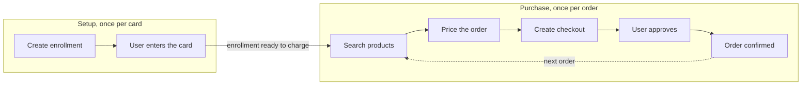
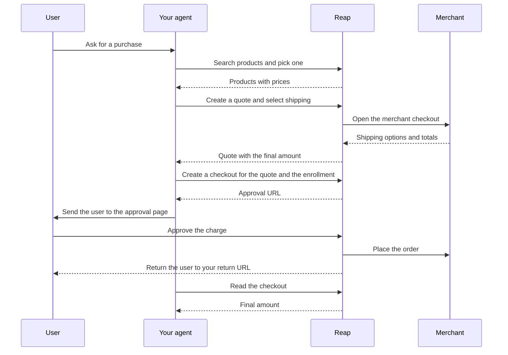

> ## Documentation Index
> Fetch the complete documentation index at: https://docs.reap.global/llms.txt
> Use this file to discover all available pages before exploring further.

# How It Works

> The actors and resources behind a single agentic purchase

export const MandateBadge = ({label = "Coming soon"}) => MANDATES_AVAILABLE ? null : 
      {label}
    ;

export const MANDATES_AVAILABLE = false;

An agentic purchase runs in two phases. Setup happens once per card. The purchase flow then repeats for every order against that stored card.

## Who does what

* The user is the cardholder who stores a card and approves each charge on a hosted page
* The client is you, and your agent chooses what to buy and drives the API calls
* Reap stores the card and prices the order with the merchant, then completes the checkout and reports the outcome
* The merchant is the seller that supplies the catalog and the current price, including the shipping options and the tax

## The two phases

Setup runs once and the enrollment stays reusable. The purchase phase then repeats for every later order.

## One purchase in detail

The search line and the quote line each stand for more than one call. [One-Time Purchases](/agentic-payments/one-time-purchases) shows every request and response in order.

## Enrollment

An enrollment stores one card and returns an ID. Create one with [`POST /agentic/enrollments`](/api-reference/agentic/create-enrollment) and pass that ID to checkout whenever you charge the card. You can charge only an enrollment with status `ACTIVE`.

The enrollment request depends on the card source. Every source requires a return URL for the hosted enrollment step.

* A Reap card uses `source` set to `REAP_CARD` with the card ID
* A BIN sponsor card uses `source` set to `BIN_SPONSOR` with the card ID and your customer's reference. Include the cardholder name and email.
* An external card uses `source` set to `EXTERNAL` with your customer's reference and email plus a return URL. The user enters the card on the hosted page

Every enrollment belongs to an owner. Reap resolves the `REAP_USER` owner from the cardholder for a Reap card. Supply a `CLIENT_REFERENCE` owner for a customer record in your own system. Every call to [`GET /agentic/enrollments`](/api-reference/agentic/list-enrollments) covers a single owner, so keep that owner reference.

[Setup](/agentic-payments/setup) walks through each source with a request and a response.

## Mandate<MandateBadge />

{!MANDATES_AVAILABLE && (
<Note>
  Mandates are not available yet. This section is published ahead of release so you can plan the integration, and the endpoints are not live in sandbox or production. Contact us for the current timeline before you build against them.
</Note>
)}

A mandate records the terms the user approved for one enrollment. It holds the approved amount, the charge frequency, the maximum number of charges, and the merchant scope. Read it with [`GET /agentic/mandates/:id`](/api-reference/agentic/get-mandate).

The approved amount acts as a ceiling. The final quote total has to stay at or below that amount for the charge to run under the same approval. You can pause, resume, and cancel a mandate. [Lifecycle and Statuses](/agentic-payments/lifecycle) covers each operation.

## Product search

Product search reads merchant catalogs and turns what the user chose into the variant a quote needs.

* [`POST /agentic/products/search`](/api-reference/agentic/search-products) returns matching products with a price range and one preview variant
* [`POST /agentic/products/details`](/api-reference/agentic/get-product-details) expands a product into its description, media, and option groups
* [`POST /agentic/products/variant`](/api-reference/agentic/resolve-variant) turns the selected options into one purchasable variant

Search returns a price range rather than one price, because shipping and tax arrive with the quote. [One-Time Purchases](/agentic-payments/one-time-purchases) shows each call with a request and a response.

## Quote

[`POST /agentic/quotes`](/api-reference/agentic/create-quote) opens the merchant checkout for the selected items and returns pricing from the merchant. It gives you the available shipping options. It also returns an itemized total with subtotal, shipping, tax, discounts, and the final amount.

A quote accepts a variant rather than a product, so resolve the chosen options to a variant first. Every quote carries an `expiresAt` value. Open the checkout before that time, and create a new quote once it passes.

## Checkout

[`POST /agentic/checkouts`](/api-reference/agentic/create-checkout) charges an `ACTIVE` enrollment for an unexpired quote. The response tells you what to do next.

* When `nextAction` is present, send the user to `nextAction.url` to approve the charge
* When the user returns to your return URL, read the checkout with [`GET /agentic/checkouts/:id`](/api-reference/agentic/get-checkout) to get `orderId` and `finalAmount`

<Warning>
  A checkout cannot open against an enrollment outside `ACTIVE`. Read the enrollment with [`GET /agentic/enrollments/:id`](/api-reference/agentic/get-enrollment) before you charge it. Create a new enrollment when the stored card is revoked or expired.
</Warning>

## Idempotency

Send an [`Idempotency-Key`](/api-reference/idempotency) header on every call that creates something. [`POST /agentic/enrollments`](/api-reference/agentic/create-enrollment), [`POST /agentic/quotes`](/api-reference/agentic/create-quote), and [`POST /agentic/checkouts`](/api-reference/agentic/create-checkout) all require it, and a call that omits the header is rejected. A retry with the same key replays the first response instead of storing a second card, creating a second quote, or running a second charge.

Send `Reap-Version` on every request. See [versioning](/api-reference/versioning) for how versions change.

## Next steps

<CardGroup cols={2}>
  <Card title="Setup" href="/agentic-payments/setup">
    Store a card and confirm it is ready to charge.
  </Card>

  <Card title="One-Time Purchases" href="/agentic-payments/one-time-purchases">
    Run the purchase phase end to end.
  </Card>
</CardGroup>

This documentation is built and hosted on [Mintlify](https://mintlify.com), a developer documentation platform.