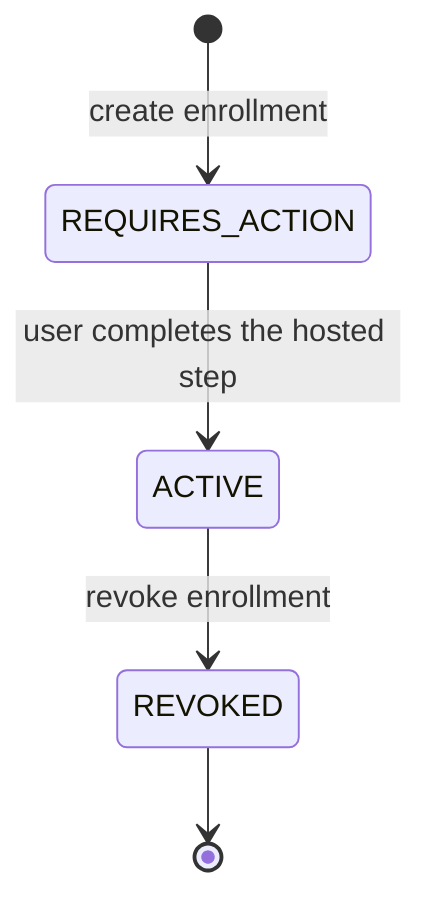
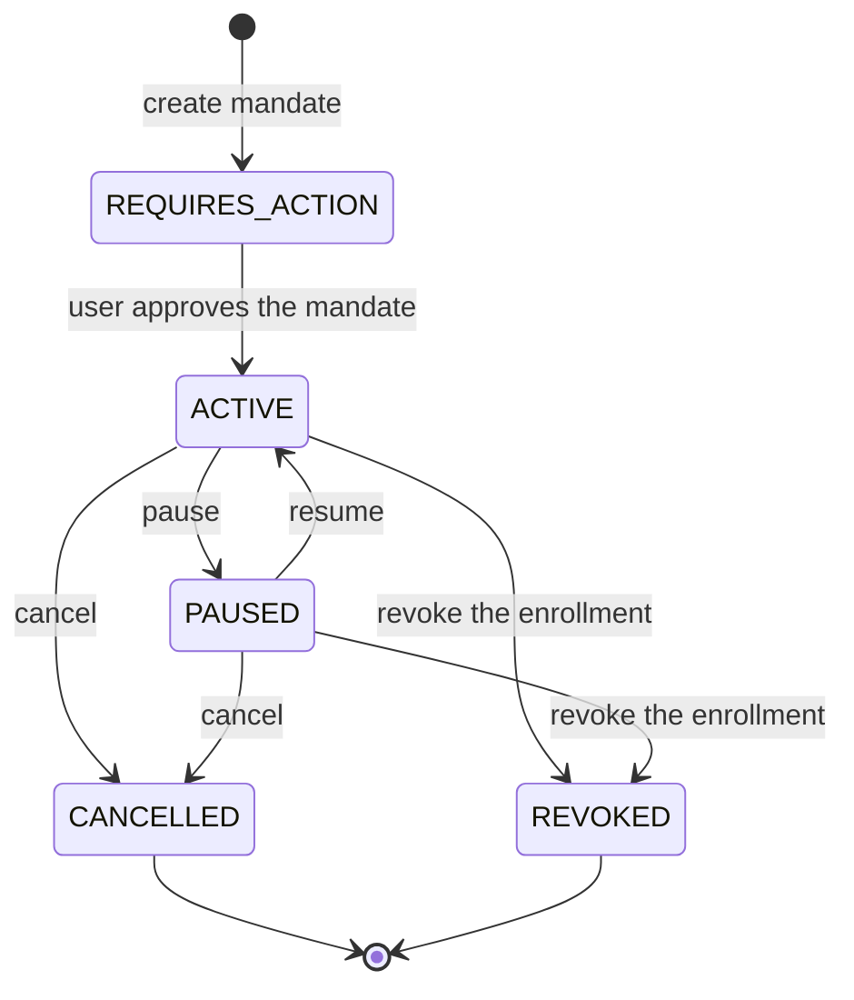
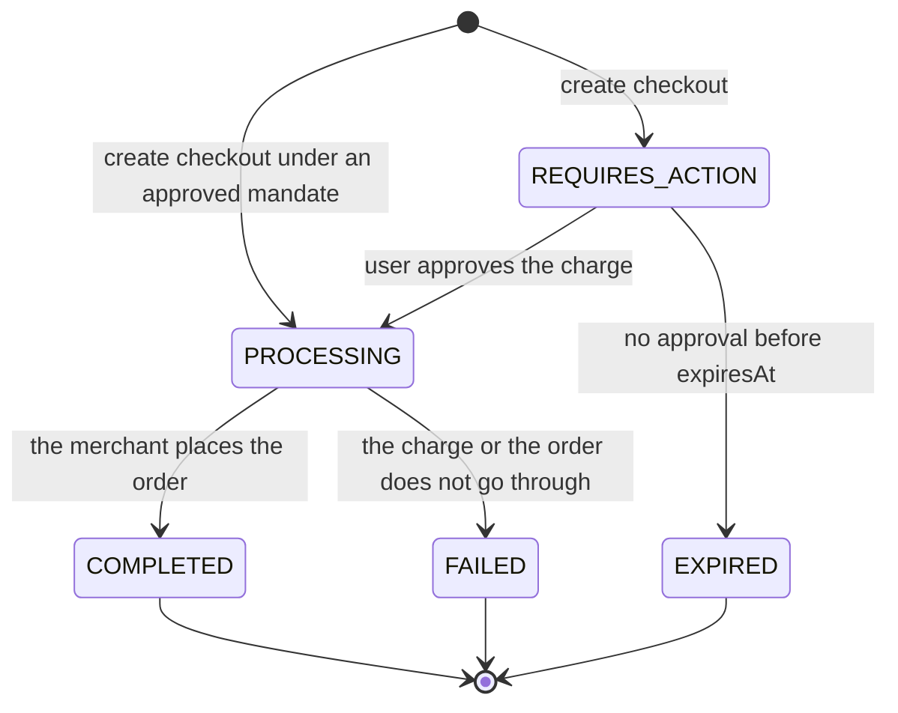

> ## Documentation Index
> Fetch the complete documentation index at: https://docs.reap.global/llms.txt
> Use this file to discover all available pages before exploring further.

# Lifecycle and Statuses

> What each status means and which operations change it

export const MandateBadge = ({label = "Coming soon"}) => MANDATES_AVAILABLE ? null : <span style={{
  display: "inline-block",
  verticalAlign: "middle",
  marginLeft: "0.4em",
  padding: "0.15em 0.65em",
  border: "1px solid rgba(113, 247, 236, 0.45)",
  borderRadius: "9999px",
  backgroundColor: "rgba(113, 247, 236, 0.12)",
  color: "#71F7EC",
  fontSize: "0.7em",
  fontWeight: 600,
  lineHeight: 1.7,
  letterSpacing: "0.02em",
  whiteSpace: "nowrap"
}}>
      {label}
    </span>;

export const MANDATES_AVAILABLE = false;

Every agentic resource reports a `status`. This page maps each value to the action it calls for, and covers the operations that move a resource from one value to the next.

## Enrollment



| Status | What it means | What to do |
| - | - | - |
| `REQUIRES_ACTION` | A hosted step is outstanding | Send the user to `nextAction.url` before `expiresAt`, then read the enrollment again |
| `ACTIVE` | The card is stored and ready | Use the enrollment ID at checkout |
| `REVOKED` | The stored card no longer accepts charges | Create a new enrollment for a replacement card |
| `FAILED` | Reap could not store the card | Create a new enrollment and send the user through the hosted step again |
| `EXPIRED` | The user did not finish the hosted step before `expiresAt` | Create a new enrollment and send the user to the new `nextAction.url` |

Reap and BIN sponsor card enrollments require hosted device binding. External cards require hosted card entry. Follow `nextAction.url` and read the enrollment again to confirm `ACTIVE`.

### Revoke an enrollment

Revoke a stored card with [`POST /agentic/enrollments/:id/revoke`](/api-reference/agentic/revoke-enrollment) when the user removes it or when the card should stop working.

```bash Request theme={null}
curl --request POST \
  --url https://sandbox.api.reap.global/agentic/enrollments/:id/revoke \
  --header 'Authorization: Bearer <token>' \
  --header 'Reap-Version: <reap-version>'
```

```json Response theme={null}
{
  "id": "<enrollment-id>",
  "status": "REVOKED",
  "owner": {
    "type": "CLIENT_REFERENCE",
    "id": "<your-customer-id>",
    "email": "jsmith@example.com"
  },
  "paymentMethod": {
    "type": "CARD",
    "network": "<network>",
    "last4": "4242",
    "expiryMonth": 11,
    "expiryYear": 2029
  },
  "nextAction": null,
  "createdAt": "2026-01-01T00:00:00Z",
  "updatedAt": "2026-01-01T00:00:00Z"
}
```

<Warning>
  Revoking is final. You cannot charge or restore a revoked enrollment. You will need to create a new enrollment to use the same card.
</Warning>

## Mandate<MandateBadge />

{!MANDATES_AVAILABLE && (
<Note>
  Mandates are not available yet. This section is published ahead of release so you can plan the integration, and the endpoints are not live in sandbox or production. Contact us for the current timeline before you build against them.
</Note>
)}



| Status | What it means | What to do |
| - | - | - |
| `REQUIRES_ACTION` | The mandate is not approved yet | Complete the step in `nextAction`, then read the mandate again |
| `ACTIVE` | Charges can run under the approved mandate | Charge inside `amount`, `maxCharges`, and `merchantScope` |
| `PAUSED` | Charges are on hold and the mandate is intact | Resume the mandate to continue |
| `CANCELLED` | You ended the mandate and the stored card stays usable | Collect a new mandate from the user |
| `REVOKED` | The enrollment behind the mandate was revoked | Create a new enrollment, then collect a new mandate |

`CANCELLED` and `REVOKED` are both end states, and neither returns to `ACTIVE`. The difference is scope. Canceling ends one mandate and leaves the stored card ready for a new one. Revoking the enrollment stops every mandate that points at that card.

### Pause a mandate

[`POST /agentic/mandates/:id/pause`](/api-reference/agentic/pause-mandate) holds charges and keeps the approved mandate.

```bash Request theme={null}
curl --request POST \
  --url https://sandbox.api.reap.global/agentic/mandates/:id/pause \
  --header 'Authorization: Bearer <token>' \
  --header 'Reap-Version: <reap-version>'
```

```json Response theme={null}
{
  "id": "<mandate-id>",
  "status": "PAUSED",
  "enrollmentId": "<enrollment-id>",
  "frequency": "WEEKLY",
  "maxCharges": 12,
  "merchantScope": "LISTED",
  "amount": { "amount": 150, "currency": "USD" }
}
```

### Resume a mandate

```bash Request theme={null}
curl --request POST \
  --url https://sandbox.api.reap.global/agentic/mandates/:id/resume \
  --header 'Authorization: Bearer <token>' \
  --header 'Reap-Version: <reap-version>'
```

[`POST /agentic/mandates/:id/resume`](/api-reference/agentic/resume-mandate) returns `status` as `ACTIVE` with the same mandate. Resuming needs no further approval from the user, because nothing about the mandate changed.

### Cancel a mandate

```bash Request theme={null}
curl --request POST \
  --url https://sandbox.api.reap.global/agentic/mandates/:id/cancel \
  --header 'Authorization: Bearer <token>' \
  --header 'Reap-Version: <reap-version>'
```

[`POST /agentic/mandates/:id/cancel`](/api-reference/agentic/cancel-mandate) returns `status` as `CANCELLED`. The enrollment stays untouched and remains available for a new purchase.

Pause and resume suit a temporary hold. Cancel ends the mandate for good. Revoking the enrollment is the wider action, because it stops charges across every mandate that points at the same stored card, and those mandates report `REVOKED` rather than `CANCELLED`.

## Quote

A quote has no status field. It has an expiry instead.

* Read `expiresAt` on every quote and open the checkout before that time
* Create a new quote with [`POST /agentic/quotes`](/api-reference/agentic/create-quote) once the expiry has passed, because merchant prices can move in between
* Read the quote at any time with [`GET /agentic/quotes/:id`](/api-reference/agentic/get-quote) to get the current total

## Checkout



| Status | What it means | What to do |
| - | - | - |
| `REQUIRES_ACTION` | The charge is waiting on user approval | Send the user to `nextAction.url` before `expiresAt` |
| `PROCESSING` | The charge is approved and the order is being placed | Read the checkout again until it reports a final status |
| `COMPLETED` | The merchant order is placed | Store `orderId` and reconcile against `finalAmount` |
| `FAILED` | The charge or the merchant order did not go through | Tell the user the purchase did not happen, then create a new quote and a new checkout |
| `EXPIRED` | The user did not approve before `expiresAt` | Create a new quote and a new checkout, because the old quote is stale |

`COMPLETED`, `FAILED`, and `EXPIRED` are final. A checkout never leaves one of them, so branch on the status value rather than treating anything other than `COMPLETED` as still in flight. Neither `FAILED` nor `EXPIRED` can be retried in place, and both need a fresh quote and a fresh checkout.

[`POST /agentic/checkouts`](/api-reference/agentic/create-checkout) returns a `nextAction` when the charge needs approval. A checkout created under a mandate the user approved earlier skips that step and moves straight into `PROCESSING`.

Read the checkout with [`GET /agentic/checkouts/:id`](/api-reference/agentic/get-checkout) after the user lands back on your return URL. Returning to that URL does not by itself mean the order is placed, so read the status. A `nextAction` of `null` on a completed checkout means you have nothing left to do.

## Next steps

<CardGroup cols={2}>
  <Card title="One-Time Purchases" href="/agentic-payments/one-time-purchases">
    The full purchase sequence with requests and responses.
  </Card>

  <Card title="FAQ" href="/agentic-payments/faq">
    Short answers to common integration questions.
  </Card>
</CardGroup>


This documentation is built and hosted on [Mintlify](https://mintlify.com), a developer documentation platform.